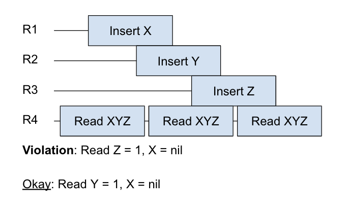
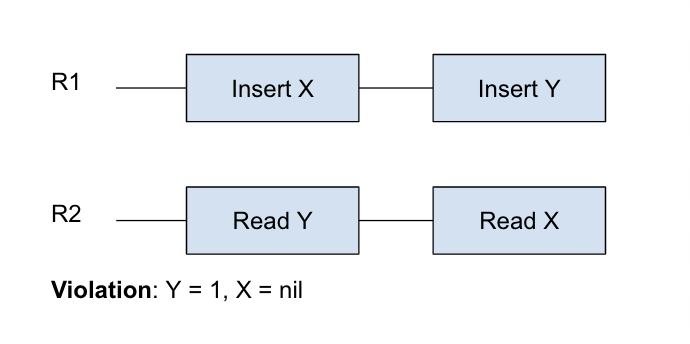
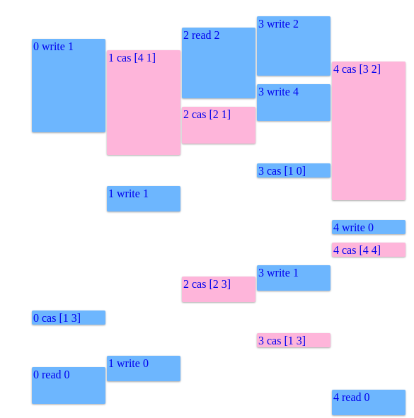
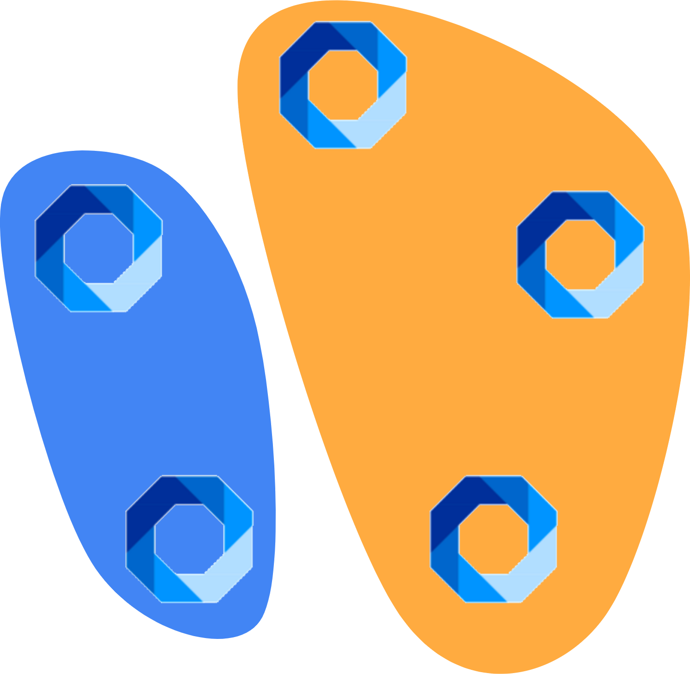
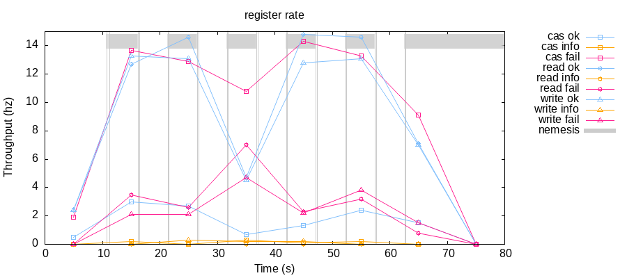

# Testing consistency of rqlite

*By [Nienke Eijsvogel](https://github.com/Nienkeeijsvogel),
[Ruben van Baarle](https://github.com/RvanBaarle)
and [Daan de Graaf](https://github.com/wildarch/jepsen.rqlite)*.

TODO

# What is rqlite?

Rqlite is an easy-to-use, lightweight, distributed relational database, which uses SQLlite as its storage engine. 
Each rqlite node exposes an HTTP API allowing data to be inserted into and read back from the database. An HTTP API is an API that uses Hypertext Transfer Protocol as the communication protocol between the two systems. 
Rqlite provides data durability via the Raft consensus system.  Every change made to the SQLite database is written to the Raft log, and that log is by default persisted to disk. The Raft log contains SQL statements and is used to distribute SQL statements to all nodes. 
once a log entry reaches a majority of nodes, the SQL statement can be applied to each SQL state.
The statements must be deterministic.
In the event of a restart or recovery operation, the SQLite database is completely rebuilt from the data contained in the Raft log. 

# Test Setup

For the test a cluster is set up with 5 Vagrant virtual machines that run Debian 11 Bullseye. 
The machines are run on a fully connected private network.
Rqlite version 7.3.1 is used. 
As a Test framework we use Jepsen and Knossos and the Rqlite-java client library.

# Jepsen Tests

## Comments

The comments test checks for strict serializability. 
Checks for a strict serializability anomaly in which T1 < T2, but T2 is visible without T1.
 

```sql
CREATE TABLE Test
(
    id  INT PRIMARY KEY,
    key INT
);
INSERT INTO Test
VALUES ((0, 1),
        (0, 2),
           /* ... */,
        (5, 98   
        (5, 99));
```

We perform concurrent blind inserts across n tables, and meanwhile, perform reads of both tables in a transaction. 
To verify, we replay the history, tracking the writes which were known to have completed before the invocation of any write w_i. 
If w_i is visible, and some w_j < w_i is not visible,
we've found a violation of strict serializability.
Splits keys up onto different tables to make sure they fall in different shard ranges

Read: "SELECT id FROM table WHERE key = "
Write: "INSERT INTO table VALUES ('" id "," k "')"



Now that the history is generated, a custom implemented checker checks for violations. 

## Sequential


## Register

The register test checks linearizability of accesses on independent registers, or individual rows in a table. We start
by creating a simple table with a few rows:

```sql
CREATE TABLE Test
(
    id  INT PRIMARY KEY,
    val INT
);
INSERT INTO Test
VALUES ((0, 0),
        (1, 0),
           /* ... */,
        (99, 0));
```

We then concurrently issue a mix of read, write and compare-and-swap operations:

- Read: `SELECT val FROM Test WHERE id = 0`
- Write: `UPDATE Test SET val = x WHERE id = 0`
- Compare-and-swap: `UPDATE Test SET val = x WHERE id = 0 AND val = y`

All these operations are on the first row of Test for now, we will need the other rows later.

In our current setup, these operations are issued concurrently by 5 different clients, so at most 5 transactions will be
in flight at any given time. We record the start and end time of each transaction, producing a log similar to this:



The height of the box marks the duration of the corresponding transaction. Operations can be successful (blue), fail (
pink) or inconclusive (orange, not shown here). The only failures we see in the diagram above are compare-and-swap
operations: this is because they only succeed if the expected value matches the one present in the database (the format
is `<client_id> cas [<expected> <new_value>]`).

Now that we have generated a transaction history, we must check if it is linearizable. Thankfully
the [knossos](https://github.com/jepsen-io/knossos)
linearizability checker provides a compare-and-swap register model for just such a test setup, so we can define the
checker as simply:

```clojure
(checker/linearizable {
:model     (model/cas-register 0)
:algorithm :linear
})
```

One caveat here is that linearizability checking is not cheap, and is in
fact [NP-Complete](https://dl.acm.org/doi/10.1137/S0097539794279614). If our history contains many transactions, knossos
will be unable to verify linearizability. A way around is to periodically switch to a different register. Since
transactions on different registers are independent, this reduces the search space significantly, while still allowing
us to be nearly as effective at testing as the original approach. In our testing setup we switch registers after every
1000 operations, for which knossos can easily verify linearizability in a few seconds on the author’s laptop.

That concludes all of our tests for linearizability and sequential consistency. In the next section we cover how to
inject faults into the tests, and test that rqlite can correctly handle them.

# Nemeses

So far we have been testing the happy path of RQLite, where communication is reliable and fast, and nodes are diligently
handling all of their requests immediately. These situations are frequent in deployments and regular integration tests,
and thus are likely to be handled correctly by databases. However, we expect databases to uphold its consistency
guarantees even in the presence of network issues or node crashes, so we augment our tests to inject faults using a
so-called ‘nemesis’. The configured nemesis toggles its effects every 5 seconds of the test run, so half of the time the
test will run under ideal conditions, and the other half it will experience faults. We have implemented four different
nemeses:

- Network partitioning: randomly partitions the nodes in two groups, each of which can communicate amongst themselves
  but not to the other group.
- Pause `rqlited`: randomly selects one of the nodes temporarily halts the rqlite daemon process.
- Network delay: Adds an average 1 second delay to messages exchanged between nodes.
- Flaky network: Randomly drops 20% of network packets sent between nodes.

Next we discuss each of them in more detail.

## Network partitioning

When this nemesis is activated, it creates two clusters of roughly the same size, and isolates them from each other. In
our case we use 5 nodes, so there will be a cluster of three nodes, and a smaller one with just two. Within a cluster
all nodes are fully connected with no network issues, and similarly connections between nodes and clients proceed
uninterrupted. Between the two clusters however, existing connections are dropped immediately, and no new connections
can be made for the duration of the nemesis. The picture below shows an illustration of two example clusters.



This has important effects for the raft consensus algorithm:

- If the current leader is in the smaller cluster, it will not be able to reach quorum, and new transactions will be
  stuck until a new leader is elected from the larger cluster (where a quorum is still possible).
- If the larger cluster processes any transactions, data in the smaller cluster becomes stale. To remain consistent, the
  smaller cluster must therefore not serve any read requests (and obviously no write or compare-and-swap either). Nodes
  in the small cluster are effectively just spinning their wheels trying to elect a leader with quorum.
- A faulty raft implementation may lead to a situation where two leaders are simultaneously active, either because a
  previous leader in the small cluster does not realise it has lost quorum, or a new leader is elected in the small
  cluster even though no quorum can be obtained. This is known as a split brain, and can quickly cause two clusters to
  diverge, with undefined results when the network is finally healed.
- When the network is healed and nodes in the small cluster can communicate with the leader again, they must ensure to
  replicate any transactions processed while the network was partitioned.

The Jepsen library provides us with
an [implementation](https://cljdoc.org/d/jepsen/jepsen/0.1.15/api/jepsen.nemesis#partition-random-halves) of this
nemesis, which we can use directly.

## Daemon pause

Instead of interfering with the network, this nemesis only affects the rqlite daemon process. When activated, it will
select one of the nodes and send a SIGSTOP signal to temporarily suspend it, rendering it unable to service any
requests. Then after 5s it will resume execution by sending SIGCONT. That particular daemon may need to correctly handle
uncommon situations:

- If the node was a leader before suspension, it may have since lost that status, but it will resume believing it is
  still a leader. If it can successfully convince some nodes that it is a leader, it may even lead to a split brain
  situation like we saw before.
- It may have missed some transactions while it was suspended that it is unaware of, which it will need to retrieve
  before it can process new requests.

This nemesis is also [provided](https://jepsen-io.github.io/jepsen/jepsen.nemesis.html#var-hammer-time) by Jepsen.

## Network delay

In our test setup all nodes are virtual machines on a single physical device, so their network latency will be extremely
low even compared to a production environment. This nemesis adds an artificial delay of 1 second on average. Such a
delay can help uncover replication bugs. For example, a write request sent to one node might normally be replicated to
other nodes faster than it takes for a read request to arrive at a second node, masking a potential bug. With a delay
introduced the second node would now be forced to either return stale data, indicating a bug, or wait until the changes
have replicated. If the delay is high enough, it might also trigger a heartbeat timeout on one or more nodes, triggering
a leader election.

Jepsen provides some building blocks to create a delay nemesis, but those were found to crash on our particular nodes
running Debian bullseye, so we implemented our own based on
Linux [Traffic Control](https://man7.org/linux/man-pages/man8/tc.8.html).

## Packet loss

Not only do production systems have higher latency than a virtual test setup, their networks are also less reliable, and
sometimes drop packets entirely. This can lead to missed updates on some nodes, and trigger edge cases in the
replication logic where messages need to be retransmitted. Our nemesis simulates an extreme case of this, where as much
as 1 in 5 packets is dropped and not delivered.

Much like the delay nemesis, the Jepsen library provided part of an implementation, but it did not work for our test
setup, so we implemented a custom nemesis, again using Traffic Control APIs.

# Results

We are happy to report that with strong read consistency enabled, Rqlite passed all our tests with flying colours. This
is not a proof that rqlite provides linearizability, as it may violate those requirements in situations we have not
tested here. Even though this is not explicitly documented, rqlite also appears to respect client order in the
processing of transactions, as this is one of the assumptions required for the sequential test to pass. One thing we
have observed is that with nemeses enabled, rqlite struggles to maintain acceptable tail latency. The graph below shows
the throughput of the cluster during the register test, with a partitioning nemesis enabled.



Based on this graph, it appears rqlite achieves up to 40 transactions per second, which considerably less than the 50Hz
at which our tests send transactions. The reason for this appears to be that a few transactions take extremely long, as
shown in the graph below.


It appears that while rqlite correctly handles faults, it introduces high tail latency in doing so. Low tail latency is
[crucial for large-scale systems](https://research.google/pubs/pub40801/), so we do not recommend rqlite to be used
there. Luckily rqlite is designed for smaller deployments, for which this may not be as important.

# Conclusion

In this project we have created Jepsen tests for the rqlite distributed database to check linearizability and sequential
consistency of the system. We conclude that for common situations as well as exceptional ones triggered by faults,
rqlite maintains linearizability of record insertion and modification, provided strong read consistency is enabled, as
evident from the tests and nemesis we have developed. This by no means constitutes a formal proof that rqlite indeed
upholds linearizability in the general case, but it suggests that rqlite is designed to provide linearizability, and
should provide users of the system with more confidence in the implementation.

There is opportunity for more Jepsen tests to be added to our setup. Common examples from other Jepsen test suites
include a [‘bank’](https://github.com/jepsen-io/jepsen/blob/main/cockroachdb/src/jepsen/cockroach/bank.clj) test for
transfers between rows of a shared table
and [‘sets’](https://github.com/jepsen-io/jepsen/blob/main/cockroachdb/src/jepsen/cockroach/sets.clj) for concurrent
unique appends to a table. Similarly more nemesis could be introduced, such as a nemesis to randomly kill and restart
nodes. We intend to discuss with rqlite’s maintainers if the jepsen tests could be added to their testing setup and
maintained there.

Our implementation is available on [GitHub](https://github.com/wildarch/jepsen.rqlite).
